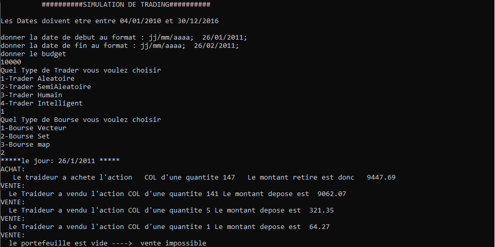
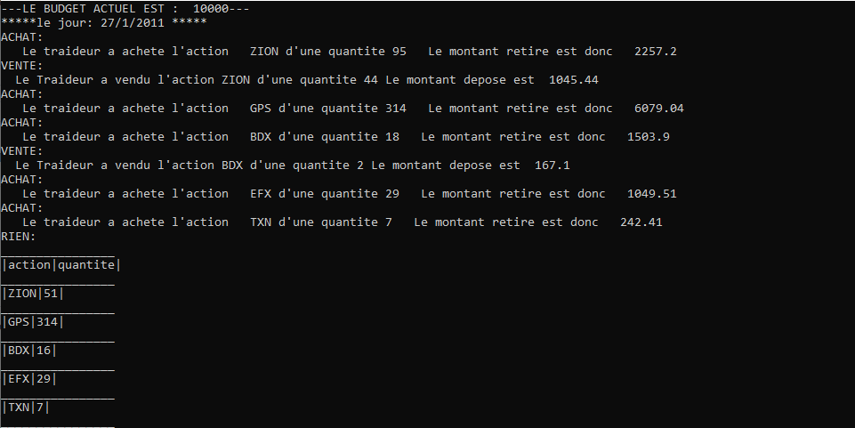
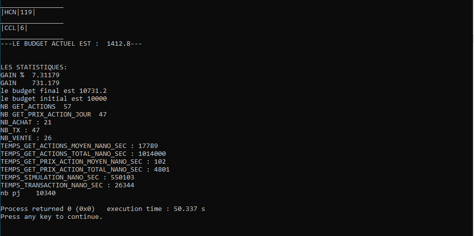
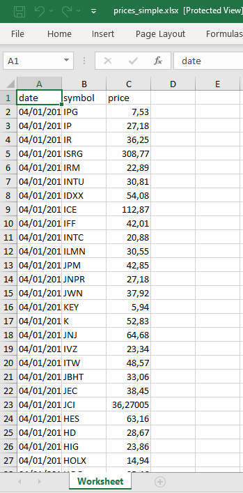
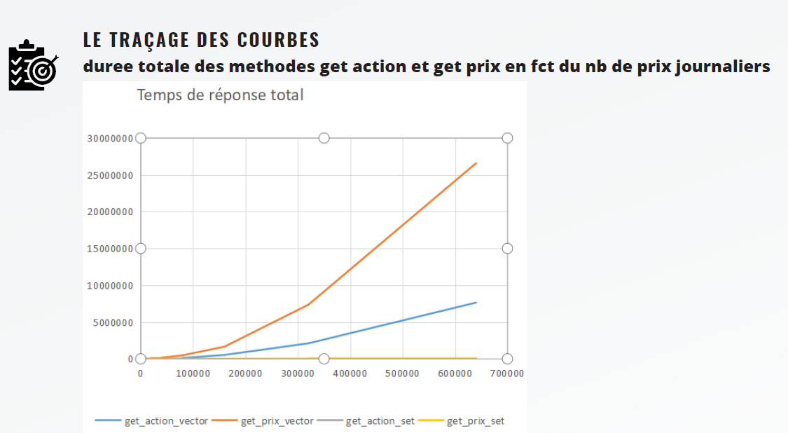
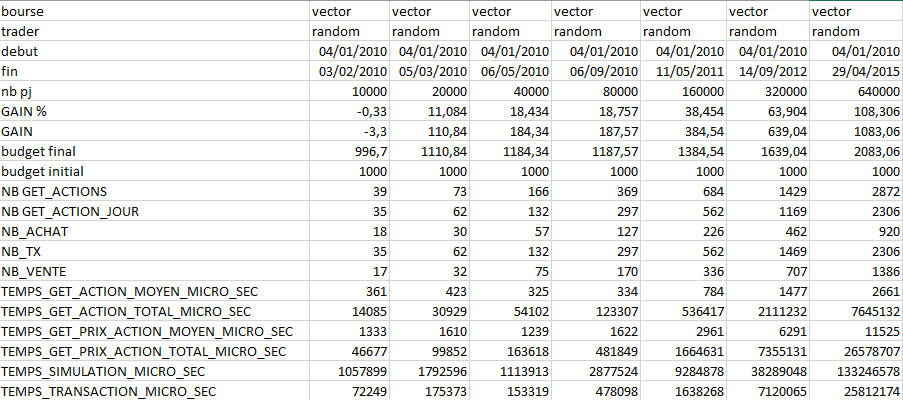
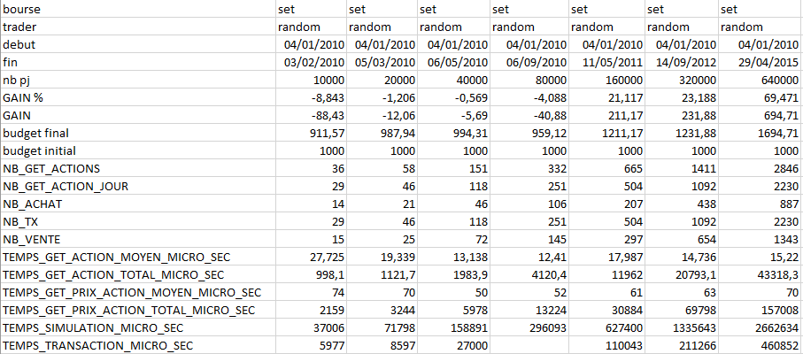

# Trading Simulation Project

## Overview

This **Trading Simulation Project** is implemented in C++ to reinforce object-oriented programming (OOP) principles and best practices. The project simulates stock trading, allowing users to select the start and end dates, the type of stock market, and the type of trader. The simulation displays the trader's actions each day, the transactions they perform, and the state of their portfolio. At the end of the simulation, performance statistics are generated and displayed.

## Features

- **OOP Implementation:** The project applies OOP principles such as polymorphism, encapsulation, inheritance, and abstraction.
- **Stock Market Simulation:** The simulation allows users to select different types of stock markets and traders.
- **Trader Actions:** The simulation provides detailed daily actions of the trader, including purchases, sales, and portfolio updates.
- **Performance Statistics:** At the end of each simulation, detailed performance statistics are provided.
- **Historical Data Access:** The project records the details of each simulation in a file for future reference.

## Screenshots

### Simulation Screenshots

### Excel File Upload

### Performance Curves

### Bourse Vector Stats

### Bourse Set Stats

## Classes and Algorithms

### Stock Market Classes

- **BourseVector Class:**
  - The `historique` attribute is a vector of daily prices.
  - **Algorithm Complexity:** `O(n)`

- **BourseSet Class:**
  - The `historique` attribute is a set.
  - Methods such as `getActionsDisponiblesParDate` and `prixJournaliersParDate` use binary search.
  - **Algorithm Complexity:** `O(log(n))`

- **BourseDictionnaire Class:**
  - The `historique` attribute is a dictionary: `<date, vecteur<prixJournaliers>>`
  - **Algorithm Complexity:** `O(n)`

### Trader Classes

- **TraderAléatoire:** Trades based on random probability.
- **TraderSemiAléatoire:** Purchases the cheapest stock and sells the most expensive one.
- **TraderHumain:** Manually trades with the ability to view the portfolio and available actions each day.
- **TraderIntelligent:** Uses a strategic algorithm with a higher probability of buying stocks due to inflation considerations.

## Functional Requirements

- Launch a simulation by specifying the start date, end date, initial balance, and type of trader (manual or algorithm-based).
- Display portfolio details (remaining balance/portfolio content at the end of each day).
- Show detailed simulation results at the end of each simulation, including statistics.
- Allow human traders to view available daily prices and trade accordingly.
- Access results from previous simulations via a file (date, trader, initial amount, etc.).

## Object-Oriented Principles

This project is a stock market simulation that applies OOP principles such as polymorphism, encapsulation, inheritance, and abstraction. Users can select a start date, end date, type of trader, and type of stock market. A trading simulation is then executed, and performance statistics of the trader and simulation are returned at the end. The details of each simulation are saved in a file for future reference.
