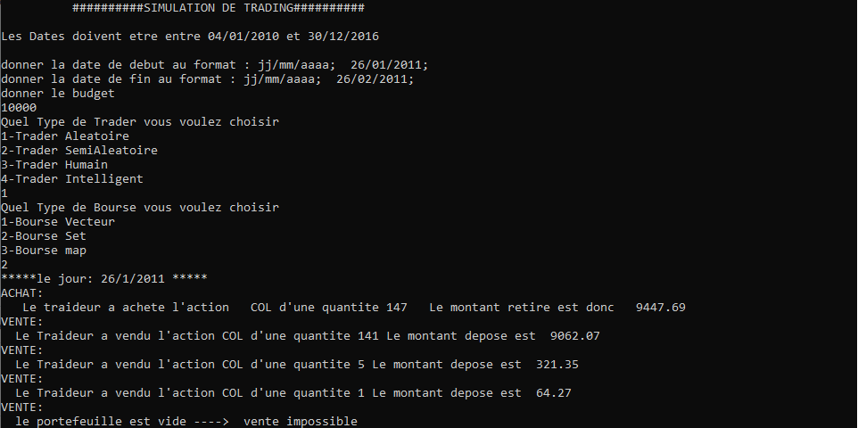
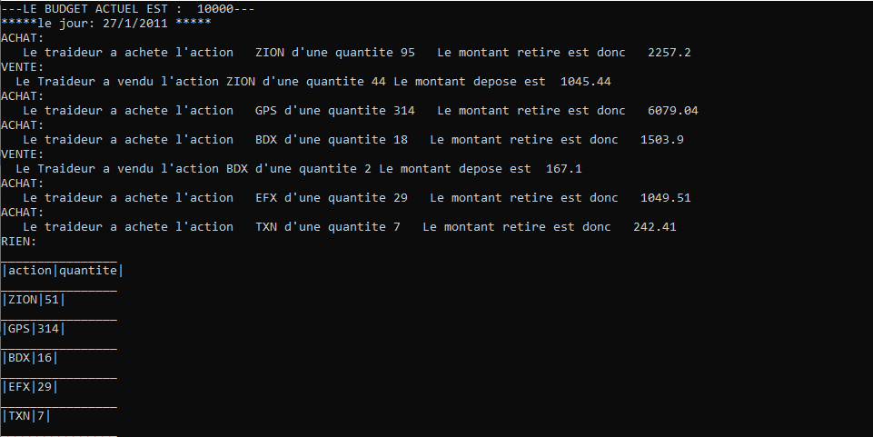
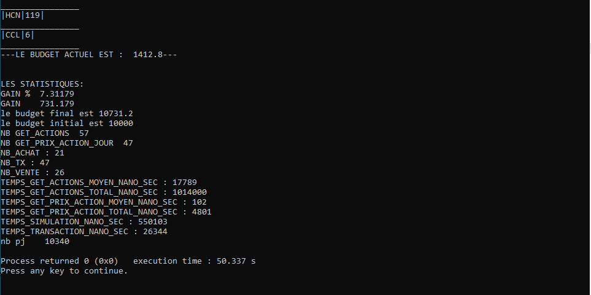
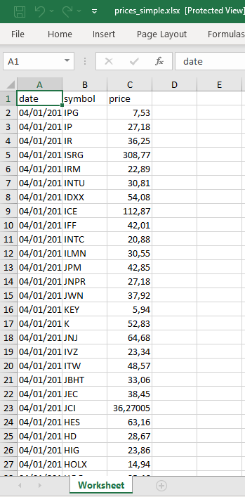
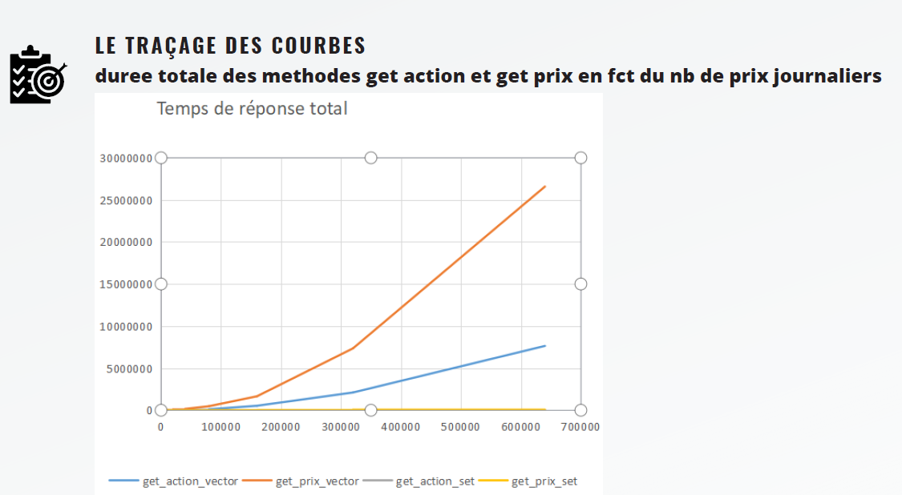
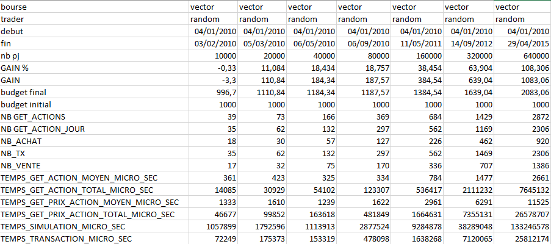
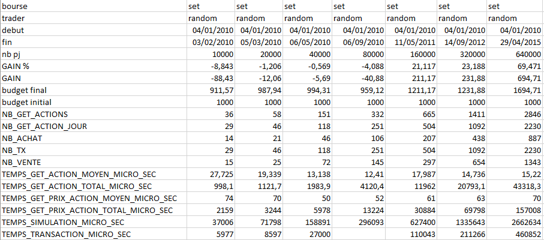

# Trading Simulation Project

I built this project to strengthen my understanding of object-oriented programming by modeling a complete stock trading simulation with multiple trader strategies and market representations. It simulates daily trading actions over a chosen time range, tracks portfolio evolution, and outputs performance statistics at the end of each run. The project is implemented in C++ using core OOP concepts such as inheritance, polymorphism, and encapsulation, with different data structures (vector, set, dictionary) to model markets and analyze algorithmic complexity.

## Screenshots

### Simulation Screenshots

### Excel File Upload

### Performance Curves

### Bourse Vector Stats

### Bourse Set Stats

